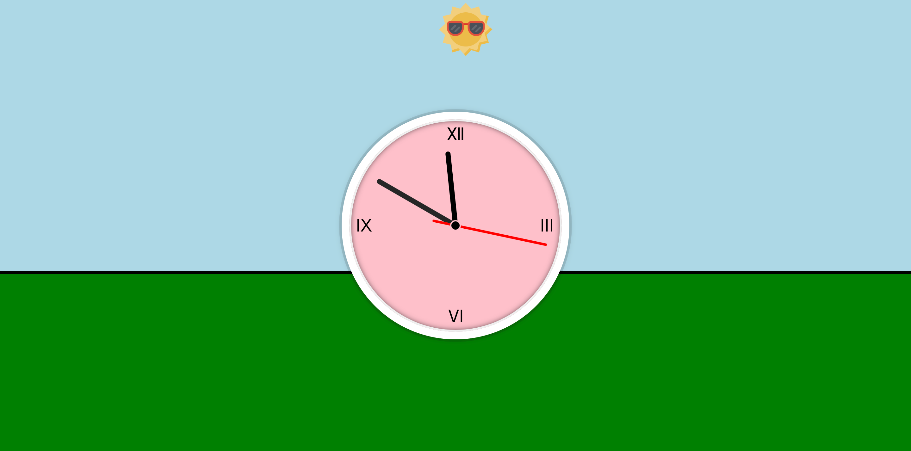
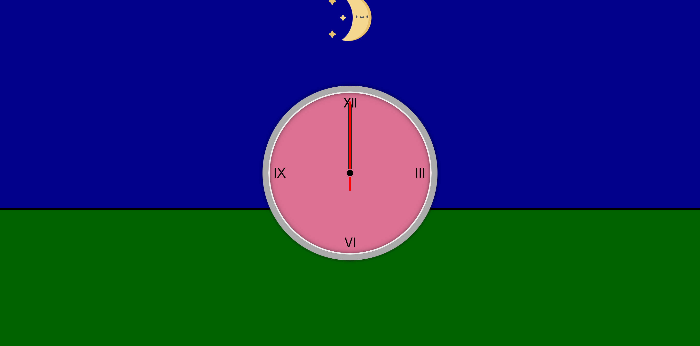
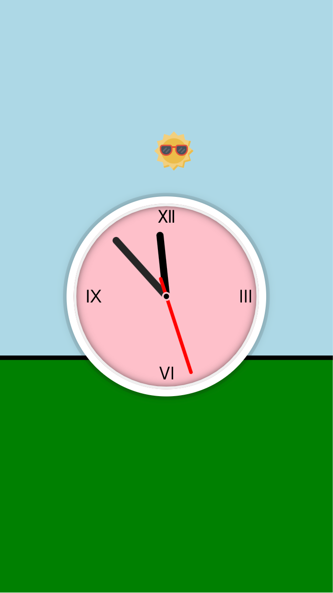
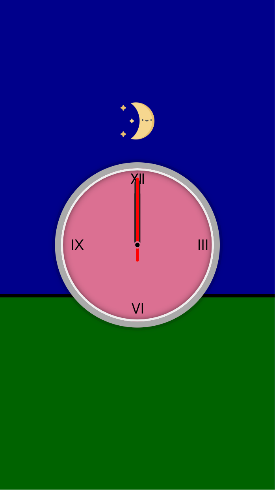

# JS30 - 02 clock

This is my solution for JS30 day two challenge!

## Table of contents
  - [Overview](#overview)
    - [The challenge](#the-challenge)
    - [Screenshot](#screenshot)
    - [Links](#links)
  - [My process](#my-process)
    - [Built with](#built-with)
    - [What I learned](#what-i-learned)
    - [Continued development](#continued-development)
    - [Useful resources](#useful-resources)

## Overview

### The challenge

Users should be able to:

- See the clock in right time.
- See the right sun and moon in the background.
- See the color change when time is over 18 clock.

### Screenshot



<div style="display: flex;">
  
  
</div>

### Links

- Live Site URL: [02-clock](https://your-live-site-url.com)

## My process

### Built with

- Semantic HTML5 markup
- CSS custom properties
- Flexbox
- Mobile-first workflow

### What I learned

The most thing I had learned is 
1. How to use JavaScript to manipulate the CSS transform property 
   - But once I found that I could only use CSS custom property to accomplish my purpose.
   - I think using CSS custom property would be more convenient than only using `HTMLElement.style.transform`.
     ```js
     hourHand.style.transform = `translate(-50%, -50%) rotate(${hourHandRotateDegree}deg)`
     // another way
     const hourHandRotateDegreeForTransform = hourHandRotateDegree.toString() + 'deg'
     hourHand.style.setProperty(rotateTime, hourHandRotateDegreeForTransform)
     ```
     ```css
     .hour-hand {
       transform: translate(-50%, -50%) rotate(var(--rotateTime))
     }
     ```
     This would avoid to reset other transform value, like translate
2. And also how to set the [cubic-bezier function](https://cubic-bezier.com/#.17,.67,.83,.67).
3. And [HTML entities, CSS code](https://www.toptal.com/designers/htmlarrows/symbols/).

### Continued development

- [ ] User could switch clock interface background color.
- [ ] User could input what picture they like for clock interface.
- [ ] User could drag the clock interface select on the top of clock interface.
- [ ] User could see more vivid background picture.

### Useful resources

- [Cubic-bezier function](https://cubic-bezier.com/#.17,.67,.83,.67) - This helped me to adjust my cubic-bezier parameters.
- [HTML entities, CSS code](https://www.toptal.com/designers/htmlarrows/symbols/) - This could help me to find HTML entities and CSS code when I set Roman number in my clock.
- [CSS property](https://css-tricks.com/a-complete-guide-to-custom-properties/) - This is a completed CSS property guideline. It's really useful.